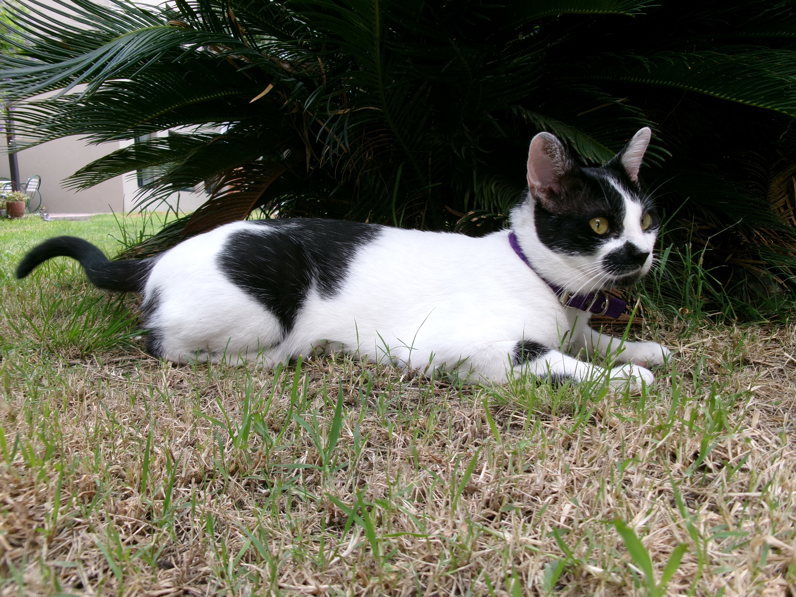

# Programación con objetos I
## Presentación Personal

### Datos Personales
- Mi nombre es: Jerónimo Tomas Mirandeborde 
- Vivo en Ituzaingo

### Otra Información
- Este es mi primer contacto con github
- Tengo un gato que se llama Chicho, adjunto pruebas a continuación: 

# Chicho
Trabajo para mi gato.
Estudio para darle mejor vida a mi gato.
Vivo por mi gato.

Espero sepan entender que, aunque sea mi presentación, es mas importante el gato.